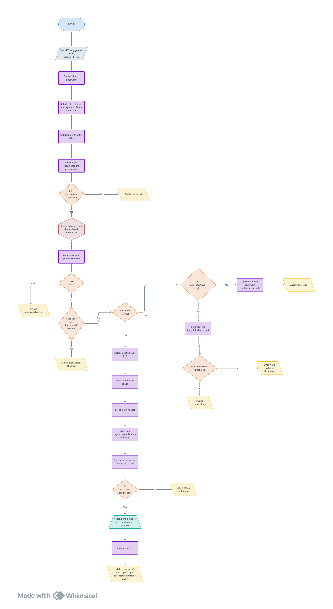
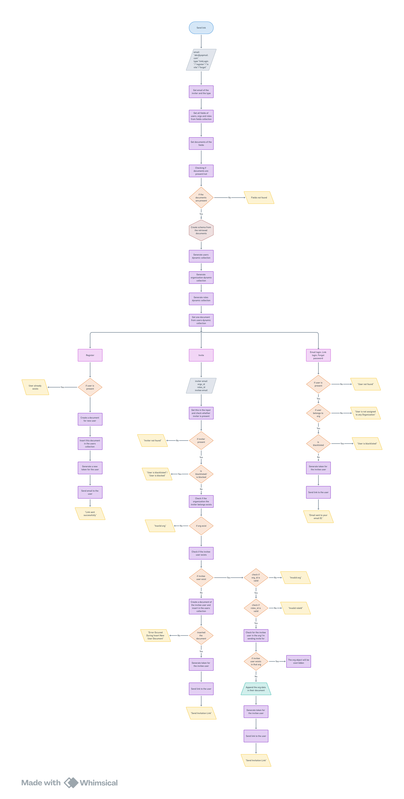
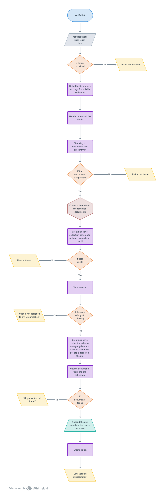
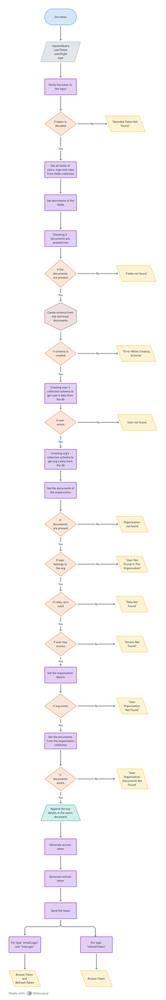
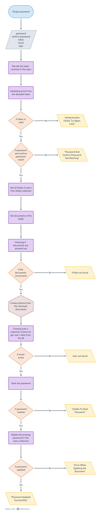
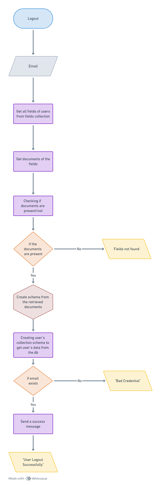

# API Documentation

Welcome to the API documentation! Here you will get a detailed description of the APIs functionality and its workflows.

---

## Authentication APIs

The Authentication API is responsible for securely managing user authentication, providing tokens for API access, and ensuring that only authorized users can access protected resources. This section covers how to authenticate users, manage tokens, and secure API requests.

## 1. **Login API**

The Login API allows a user to log in by verifying their credentials (email and password). If the credentials are correct and the user is not blacklisted or blocked, it returns a JWT token. If the user fails to log in after a certain number of attempts, their account will be blocked.

```bash
{
 "email":"sck@yopmail.com",
 "password":"Sarvesh@2"
}

```

### Workflow



+ **Entering Your Email and Password:**
The process starts when you enter your email and password into the login form or send a request to log in. This information is sent securely to the system to check the user exists.

+ **Preparing to Verify Your Information:**
Once you try to log in, the system gets ready to verify your details. It looks up important information(fields of users and orgs) from the database to understand what data it needs to work with.

+ **Fetching Necessary Information:**
The system then gathers all the necessary details(fields) from the database to check if everything is in order. If any key information is missing, the system will let you know with an error message like "Fields not found."

+ **Creating a Structure:**
After collecting all the needed information, the system creates a structured way(schema) to store and manage your data.

+ **Set Up Separate Structure for Users:**
Building a user collection structure(schema) to retrieve user data from the database.

+ **Checking if Your Account Exists:**
Before doing anything else, the system checks to see if your account exists. If it finds your account, it continues; if not, it will inform you with a message like "User doesn’t exist."

+ **Reviewing Your Account Status:**
If your account is found, the system checks to make sure you’re allowed to log in. It looks for any reasons you might be blocked/ blacklisted or restricted from accessing your account.

+ **Verifying Your Password:**
Next, the system checks if the password you entered is correct.
If the password is wrong and you’ve tried to log in too many times (three or more), your account will be blocked for security reasons. If you haven’t reached that limit, the system will simply note the failed attempt.

+ **Resetting Failed Login Attempts:**
If you enter the correct password, the system resets your failed login attempts to zero, allowing you to continue without any issues.

+ **Securing Your Session:**
The system then creates a special token(JWT) that allows you to stay logged in securely. This token is included in the response header and will be used for future requests while you’re logged in.

+ **Handling Your Organization’s Data:**
If you’re part of an organization, the system also gathers and manages any organization-related information needed for your login session. If it can’t find this information, it will show an error saying "Organization not found."

+ **Updating Your Account with Organization Details:**
The system then adds your organization’s name to your account details to make it easier to manage your data.

+ **Successful Login:**
If everything checks out, the system finishes by telling you "Login successful. Welcome back!" and you’re ready to go.


## 2. **SendLink API**

The Send Link API sends various types of links (e.g., registration, invitation, link login, forgot password) to a user's email based on the request type.

```bash
{
    "email":"sck@yopmail.com",
    "type":"linkLogin"/"register"/"invite"/"forgot"
}

```

### Workflow

  

+ **Get the Email and Type:**
The process begins by gathering the inviter's email and the type of request (e.g., Register, Invitation, Email Login, Link Login, Forgot Password).

+ **Prepare the Necessary Information:**
The system fetches the required details(fields) about users, organizations, and roles from the database to create a structured setup(schema).

+ **Check for Missing Information:**
The system verifies that all the needed documents are present. If anything is missing, it stops and reports an error "Fields not found".

+ **Create the Structure:**
Based on the gathered information, the system sets up a structure(schema) to handle user, organization, and role data.

+ **Set Up Separate Structure for Users, Organizations, and Roles:**
Building a user collection structure to retrieve user, organization, roles data from the database.

+ **Check for Existing Users:**
The system looks for the user in the database and proceeds based on the type of request:
    
+ **Case 1: Register (When someone is signing up)**

  + Check the User’s Status: The system checks if the user already exists, or if they are blocked or blacklisted.

  + If the User Exists: The system will stop and notify that the user already exists.

  + Create a New User: If the user doesn’t exist, a new account is created, and the user is added to the database.

  + Send a Link: A token (JWT) is generated, and a registration link is sent to the user's email.

+ **Case 2: Invitation (When inviting someone to join an organization)**

  + Check the Inviter’s Status: The system checks if the inviter (the person sending the invite) is valid, not blocked, and belongs to an existing organization. 
  
    + If the inviter is not found or is invalid, the process stops, and an error message is shown.
  
  + Verifying the Inviter's Organization: The system checks if the organization that the inviter belongs to exists in the database. If the organization is not found, then an error message "Invalid organization" is returned.

  + Check the Invitee’s Status: The system checks if the person being invited (invitee) already exists in the system. If the invitee already exists then it checks that it's organization and role is valid.
    +  If not valid, then an error message "Invalid organization" or "Invalid roleId" is returned. 
    + If valid, then the system checks for the invitee in the organization it is sending invite for. 
    + The system then adds your organization’s name to your account details.
    + Generate token for the invitee user.
    + Send the invitation link.

  
  + Create an Account for the Invitee: If the invitee doesn’t exist, a new account is created, and the invitee is added to the database.
  
  + Send the Invitation: A token is generated, and an invitation link is sent to the invitee's email.
  
  + Additional Checks: The system also verifies if the role and organization data are correct before sending the invitation.

+ **Case 3: Email Login, Link Login, Forgot Password (When logging in or resetting a password)**

  + Verify User Status: The system checks if the user exists, belongs to the right organization, and is not blacklisted.
  
  + Send a Login or Reset Link: A token is generated, and the appropriate link (login or password reset) is sent to the user’s email.

  > NOTE: Incase the user is blocked, to unblock the account the user has to successfully sign in with link or set correct password using forgot password with link.


## 3. **Verify Link API**

The Verify Link API verifies a token sent to a user for various purposes, such as emailLogin, linkLogin, registration, forgot, or invitation. It performs different actions based on the type of the token and returns a new JWT token if the verification is successful.


```bash
request query
user token 
type

```

### Workflow

  

+ **Receive Request Information:**
The process starts by getting the request details, including the user token and the type of request.

+ **Check for the Token:**
The system checks if a token is provided. If not, it stops and returns an error saying, "Token not provided."

+ **Gather Necessary Information:**
The system retrieves details(fields) about users and organizations from the database to set up the data structure.

+ **Verify Required Documents:**
The system checks if all necessary documents are available. If any are missing, it returns an error: "Fields not found."

+ **Create The Structure:**
After collecting all the needed information, the system creates a structured way(schema) to store and manage your data.

+ **Set Up Separate Structure for Users:**
Building a user collection structure(schema) to retrieve user data from the database.

+ **Validate User and Organization:**
The system confirms if the user is valid and belongs to an organization. If not, it returns an error: "User is not assigned to any organization."

+ **Set Up Separate Structure for Organization:**
Using the organization information, the system creates a structure to manage and retrieve the organization's data.

+ **Retrieve Organization Documents:**
The system fetches the organization’s documents. If the documents are missing, it returns an error: "Organization not found."

+ **Update User Information:**
The system adds the organization name to the user’s record.

+ **Generate a New Token:**
The system generates a new token for the user.

+ **Successful Verification:**
The system confirms that the link has been successfully verified.


## 4. **Get Token API**

This Get Token API generates an access token for a user based on the provided token, type, organization ID, and department ID. It verifies the user’s credentials, organization, and department before generating the token.


```bash
requestQuery
userToken
userOrgId
type

```

### Workflow

  

+ **Receive Request Details:**
The process starts by getting the request details, including the query, user token, user organization, and request type.

+ **Verify and Decode the Token:**
The system checks if the token is valid and decodes it. If it can’t decode the token, it returns an error: "Decoded Token Not Found."

+ **Gather Necessary Information:**
The system retrieves details(fields) about users, organizations, and roles from the database to set up the data structure.

+ **Check for Required Documents:**
The system verifies that all necessary documents are present. If any are missing, it returns an error: "Fields not found."

+ **Create The Structure:**
After collecting all the needed information, the system creates a structured way(schema) to store and manage your data.

+ **Set Up Separate Structure for Users:**
Building a user collection structure(schema) to retrieve user data from the database.

+ **Verify User Existence:**
The system checks if the user exists in the database. If not, it returns an error: "User not found."

+ **Set Up Separate Structure for Organization:**
Building a user collection structure(schema) to retrieve organization data from the database.

+ **Check for Required Organization Documents:**
The system verifies that all necessary documents are present. If any are missing, it returns an error: "Organization not found."

+ **Check Organization Details:**
The system verifies that the organization exists and checks if the user belongs to that organization. If not, it returns an error: "User not found in the organization."

+ **Validate Role and Access:**
The system checks if the role ID is valid and if the user has the necessary access. If either is invalid, it returns errors: "Role not found" or "Access not found."

+ **Retrieve and Verify Organization Information:**
The system checks that the user's organization exists and retrieves the relevant documents. If anything is missing, it returns errors like "User organization not found" or "User organization documents not found."

+ **Update User Information:**
The system adds the organization name to the user’s record.

+ **Generate Tokens:**
The system generates both an access token and a refresh token for the user.

+ **Send the Tokens:**
  + If the request type is “emailLogin” or “linkLogin,” both the access token and refresh token are sent.
  + If the request type is “refreshToken,” only the refresh token is sent.


## 5. **Forgot password API**

The forgot password API allows a user to reset their password by providing a valid token, email, new password, and password confirmation.

```bash
password
confirm password
token
email
type

```

### Workflow

  

+ **Receive Input Details:**
The process starts by receiving the password, confirm password, token, email, and request type.

+ **Decode the Token:**
The system decodes the token provided in the input to validate the request.

+ **Validate the Email:**
The system checks if the email from the decoded token is valid. If the token is invalid, an error is returned: "Authentication failed. Try again later."

+ **Match Password and Confirm Password:**
The system verifies if the entered password and confirm password match. If they don't, it returns an error: "Password and confirm password not matching."

+ **Retrieve Necessary User Information:**
The system gathers the required details(fields) from the database to access user information.

+ **Verify Document Availability:**
The system checks if the necessary documents are available. If any are missing, it returns an error: "Fields not found."

+ **Create The Structure:**
After collecting all the needed information, the system creates a structured way(schema) to store and manage your data.

+ **Set Up a Separate Structure for User:**
The system creates a structure to organize and retrieve user data from the database.

+ **Check if the Email Exists:**
The system verifies if the provided email exists in the database. If not, it returns an error: "User not found."

+ **Hash the New Password:**
The system hashes the new password for security. If the password cannot be hashed, an error is returned: "Unable to hash password."

+ **Update the Password:**
The system updates the existing password in the user’s record. If the update fails, it returns an error: "Error while updating the document." If successful, it confirms with a message: "Password updated successfully."


## 6. **Logout API**

The Logout API allows a user to logout using the email.

```bash
email

```

### Workflow

  

+ **Receive Email Input:**
The process starts by receiving the user's email as input.

+ **Retrieve User Information:**
The system gathers the required details(fields) from the database to access user information.

+ **Verify Document Availability:**
The system checks if the necessary documents are available. If any are missing, it returns an error: "Fields not found."

+ **Create The Structure:**
After collecting all the needed information, the system creates a structured way(schema) to store and manage your data.

+ **Set Up a Separate Structure for User:**
The system creates a structure to organize and retrieve user data from the database.

+ **Check if the Email Exists:**
The system verifies if the provided email exists in the database. If not, it returns an error: "Bad credentials."

+ **Successful Logout:**
If the email is found, the system sends a success message: "User logout successfully."


