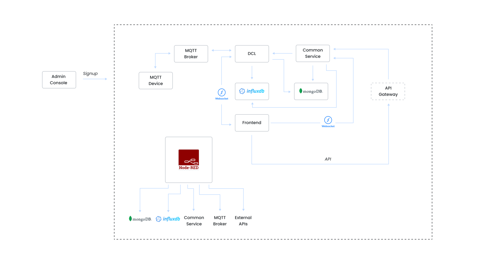

# EazyIoT Architecture

Here is a detailed description of each element in the architecture, along with their respective functionalities:

### 1. **Devices**
**Functionality:**
- Devices act as data sources, collecting various forms of data such as sensor readings or status updates.
- They send this data to the broker using the MQTT protocol.

**MQTT Protocol:**
- **Description:** MQTT (Message Queuing Telemetry Transport) is a lightweight messaging protocol optimized for high-latency or unreliable networks. It uses a publish/subscribe model for communication between devices and the broker.

---

### 2. **MQTT Broker**
**Functionality:**
- The broker receives messages from devices using the MQTT protocol.
- It acts as a mediator between devices and the Data Conversion Layer (DCL), ensuring that messages are appropriately distributed.

**Key Roles:**
- **Message Routing:** Routes incoming messages from devices to the appropriate subscribers, such as the DCL.
- **Message Management:** Manages the state of each message, ensuring delivery to the intended recipient.

---

### 3. **Data Conversion Layer (DCL)**
**Functionality:**
- The DCL converts incoming messages from the MQTT broker into the appropriate format for further processing.
- It handles data transformation and routing to different services or storage solutions based on data nature (e.g., time series or regular data).

**Connections:**
- **Frontend:** DCL is connected to the frontend using a socket, allowing real-time data flow directly to the user interface.
- **Backend:** Integrates with backend services to route data to appropriate storage solutions or processes.

---

### 4. **InfluxDB**
**Functionality:**
- InfluxDB is used for storing time-series data such as sensor readings, event logs, and performance metrics.
- It provides high availability and fast querying capabilities for time-series data, enabling real-time monitoring and analysis.

**Usage:**
- **Time-Series Data Storage:** Ideal for scenarios where the timestamp and frequency of data points are crucial for analysis.

---

### 5. **MongoDB**
**Functionality:**
- MongoDB is used for storing regular (non-time-series) data, such as user profiles, configurations, or transactional data.
- It provides a flexible, scalable document-oriented database solution.

**Usage:**
- **General Data Storage:** Suitable for data that does not primarily rely on timestamps for its structure or queries.

---

### 6. **Frontend**
**Functionality:**
- The frontend provides the user interface for interacting with the data and system.
- It is connected to the DCL via a socket to receive real-time data updates directly.

**Key Components:**
- **UI/UX:** Presents data in an understandable and interactive manner for end-users.
- **Real-Time Interaction:** Displays live data updates from the DCL, allowing users to monitor and react to changes quickly.

---

### 7. **API Gateway**
**Functionality:**
- The API Gateway acts as a single entry point for the frontend to interact with backend services.
- It handles routing, authentication, and command transfer to backend services.

**Roles:**
- **Request Handling:** Receives API commands from the frontend and routes them to the appropriate backend services.
- **Security:** Manages authentication and authorization for API requests.

---

### 8. **Common Services**
**Functionality:**
- Common services provide essential functionalities required by multiple parts of the system, such as data validation, normalization, or action triggers.
- They enable the implementation of desired actions/services for devices.

**Roles:**
- **Data Processing:** Handles intermediate processing tasks that are common across different workflows.
- **Service Provisioning:** Facilitates the execution of specific services or actions based on data and triggers.

---

### 9. **Node-RED**
**Functionality:**
- Node-RED utilizes various components such as MongoDB, InfluxDB, common services, MQTT broker, and external APIs.
- It is a flow-based, low-code development tool for visual programming developed originally by IBM for wiring together hardware devices, APIs and online services as part of the Internet of things.

**Advantages:**
- **Open Source:** Customizable and extendable, allowing for the integration of new functionalities.
- **Visual Programming:** Simplifies the creation of workflows and integrations through a visual interface.

**Replaces Kafka:**
- **Context:** Kafka was previously used for real-time data streaming between common services and the DCL. Node-RED offers a more accessible and adaptable solution for accessing system components, reducing the need for Kafka's complexity in this architecture.

---

